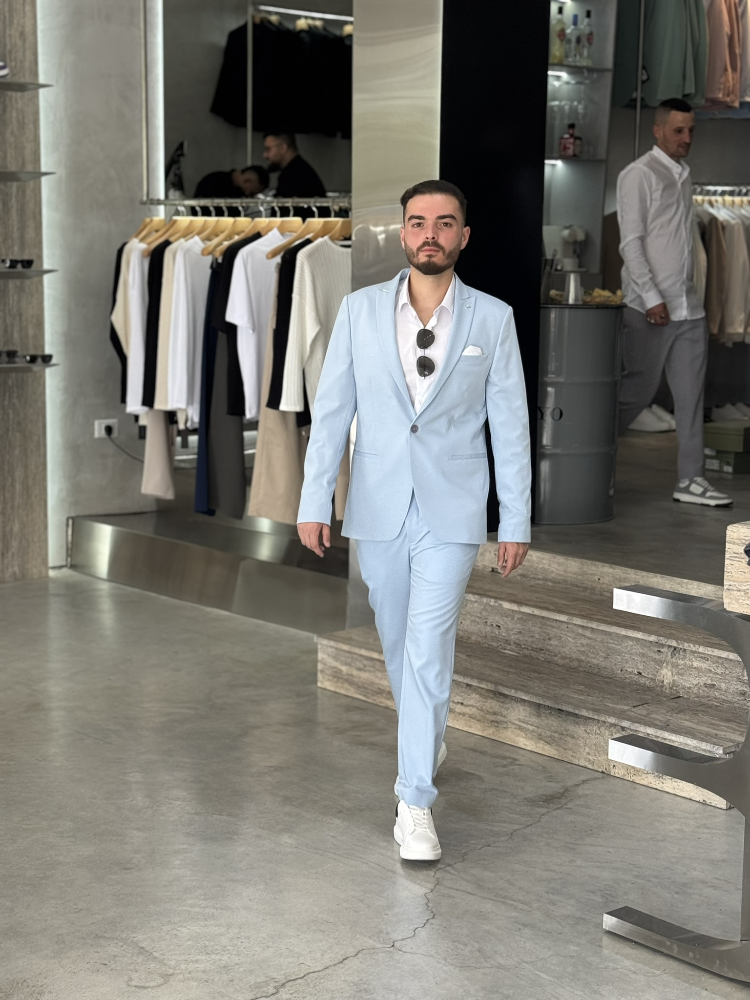

# M.B.S Studio – מדריך הפעלה בעברית

מערכת AI שמתרגמת הרצאות ארוכות לפודקאסטים קצרים, מצגות ויזואליות וחוויה בסגנון NotebookLM – הכל בעברית ובממשק אחד.

**גרסה: 3.4.0** | **עדכון אחרון: דצמבר 2025**  
[English README](README.md) · [Issues & תמיכה](https://github.com/<org>/podcast-generator/issues)

---

## תוכן העניינים
1. [סקירה מהירה](#סקירה-מהירה)
2. [מה חדש ב-3.4.0](#מה-חדש-ב-340)
3. [Hotfix 3.2.1](#hotfix-321)
4. [תכונות בולטות](#תכונות-בולטות)
5. [דרישות מוקדמות](#דרישות-מוקדמות)
6. [התקנה והגדרת סביבה](#התקנה-והגדרת-סביבה)
7. [הרצה מה-CLI](#הרצה-מה-cli)
8. [עבודה ב-GUI (M.B.S Studio)](#עבודה-ב-gui-mbs-studio)
9. [יצירת ויזואליים עם Google AI](#יצירת-ויזואליים-עם-google-ai)
10. [ניהול עלויות ולוגים](#ניהול-עלויות-ולוגים)
11. [מבנה הפרויקט](#מבנה-הפרויקט)
12. [פתרון בעיות נפוצות](#פתרון-בעיות-נפוצות)
13. [תרומה ורישיון](#תרומה-ורישיון)

---

## סקירה מהירה
- מקבלים תמלול (SRT/TXT) ומטא-דאטה → יוצרים דיאלוג בין שני מנחים (Roee & Noa).
- ממירים את הדיאלוג לפודקאסט בעברית, ומציגים גלריה של תוצרים (אודיו, וידאו, PPTX, Story).
- שולטים בהכול מתוך ה-GUI: היסטוריית ריצות, צ'אט עם מודל AI, העלאת חומרים, ותצוגות נתונים.

## מה חדש ב-3.4.0
- Imagen עודכן במלואו ל-Imagen 4 (Fast/Standard/Ultra) עם מחירי $0.03/$0.04/$0.06; בחירות Imagen 3 מתעדכנות אוטומטית.
- מרכז עלויות (Advanced FinOps): ימי איפוס נפרדים ל-Azure/Gemini/ElevenLabs, חישוב מחזור חודשי ב-UTC (ימים עד איפוס + התקדמות מחזור), והיסטוריה קבוצתית לפי חודש עם סכומי עלות.
- הגנה על ויזואליים: זיהוי `visual_metadata.json` קיים בעת טעינת פרויקט, סימון ירוק וחיווי לפני יצירה מחדש כדי למנוע חיובים מיותרים.
- הערכות עלות ומסכי הגדרות משתמשים במחיר המודל שנבחר ב-Imagen 4.

## Hotfix 3.2.1
- היברידי: שמירת תמונות Imagen/AI יחד עם קליפי Manim/VEO – אין יותר איבוד תמונות.
- אודיו/וידאו: כופים משך וידאו שווה למשך האודיו; נפילת FFmpeg אוטומטית אם MoviePy נכשל או מוציא וידאו שקט.
- יציבות GUI: `sys.excepthook` גלובלי כותב ל־`processing_log.txt` ומציג הודעת שגיאה במקום קריסה שקטה.
- שרידות API: כשלי Gemini/Imagen מייצרים פלייסהולדרים מיידית, כך שהפייפליין ממשיך להסתיים בהצלחה.

---

## תכונות בולטות
- Pipeline אוטומטי בשלושה שלבים (דיאלוג → TTS → וידאו/מצגת) עם שליטה בדגלים.
- NotebookLM-style metadata: העשרת מטא-דאטה וסטורי ב-Gemini/Azure.
- Production Guardian: בודק ויזואליים, מסיר פריימים שחורים, Ken Burns לתמונות, טיימליין אדפטיבי, נירמול אודיו.
- Voice Lab: הקלטה/עצירה/תצוגה מראש/מחיקה ברקע כדי לשמור על UI מהיר; שיכפול ElevenLabs.
- תמיכה מלאה בעברית: RTL בצ'אט, Story עברי, פקדים בעברית.
- Cost Center + לוגים: `processing_log.txt` ו-`history.json` בכל ריצה.

### חדש בגרסאות קודמות (תקציר)
- 3.2.0: Production Guardian, Voice Lab ברקע.
- 3.1.3/3.1.1: אשף ויזואלי אמין, visual_metadata אוטומטי לגיבוי, חיווי מערכת.
- 2.6.1: מצבי ויזואליים (Manim/Imagen/VEO/Hybrid), AI-helper לתמונות, מחשבון עלויות.
- 2.4.0: Google AI Visuals (Imagen 4 + VEO), Heartbeat, תיקון וידאו+אודיו.

---

## דרישות מוקדמות
1. Python 3.9+
2. FFmpeg ב-PATH (`ffmpeg -version`)
3. Azure OpenAI (GPT-4o/4-turbo) + Azure Speech Services
4. אופציונלי: מפתח Gemini (לויזואליים/מטא-דאטה) ו-ElevenLabs (קולות פרימיום)

## התקנה והגדרת סביבה
```bash
git clone https://github.com/<org>/podcast-generator.git
cd podcast-generator
python -m venv .venv
.venv\Scripts\activate  # Windows
pip install -e .[dev]
cp .env.example .env
```
מלאו ב-`.env` את המפתחות ל-Azure OpenAI/Speech, ואופציונלית:
```env
GEMINI_API_KEY=...
IMAGEN_MODEL=imagen-4.0-generate-001
VEO_MODEL=veo-2.0-generate-001
ELEVENLABS_API_KEY=...
```

## הרצה מה-CLI
```bash
python -m scripts.generate_podcast \
  data/sample_transcript.txt \
  data/sample_metadata.json \
  --include-visuals \
  --voice-profile classic \
  --export-ppt
```
דגלים שימושיים: `--dry-run`, `--skip-cache`, `--force`, `--material`, `--url`, `--output-dir`.

## עבודה ב-GUI (M.B.S Studio)
1. הפעלה: `launch_gui.bat` (או `python -m src.gui.app`).
2. אזורים:
   - **Projects Hub**: היסטוריה, כרטיסי תוצרים, ציר זמן.
   - **Workspace**: צ'אט Gemini/Azure, העלאת קבצים/קישורים, Story חי.
   - **Control Panel**: בחירת תמלול, מצב תוצר, פרופיל קולות, הפעלת Pipeline, סטטוס ריצה.
3. כפתורי באנר: רענון/עדכונים, גיבוי/שחזור, אודות, מרכז עלויות, הגדרות תצוגה, מרכז לוגים, 🎨 הגדרות ויזואליים.
4. Voice Lab: העלאה/הקלטה, Clone with ElevenLabs, מציג יתרת תווים.

## יצירת ויזואליים עם Google AI
| מנוע | תיאור | עלות |
|------|--------|------|
| Manim | אנימציות מקומיות | חינם |
| Imagen 4 | תמונות (מפות רשת/דיאגרמות/רקעים) | $0.03-$0.06 לתמונה |
| VEO | סרטוני AI קצרים (עד 3) | ~$0.75 לשנייה |
| Hybrid | שילוב Manim + Imagen/VEO | משתנה |

הגדרות ב-`.env`:
```env
VISUAL_GENERATOR=hybrid
IMAGEN_MODEL=imagen-4.0-generate-001
VEO_MODEL=veo-2.0-generate-001
IMAGE_COUNT=5
```
אין מפתח נפרד ל-Imagen/VEO – משתמשים ב-`GEMINI_API_KEY` ובפרויקט GCP עם Vertex AI מופעל.

## ניהול עלויות ולוגים
- מגבלות חודשיות ל-TTS/OpenAI מומלצות.
- מחשבון עלויות במרכז העלויות (GPT/TTS/וידאו/PPTX).
- כל ריצה: `processing_log.txt` + `history.json` עם עלות, זמני שלבים ותוצרים.

## מבנה הפרויקט
```
src/
├── gui/           # אפליקציית PyQt6, פאנלים, דיאלוגים, Voice Lab
├── audio/         # TTS, stitching
├── dialogue/      # יצירת דיאלוג
├── visuals/       # Manim + Video composer + Google AI
├── pipeline/      # runner/orchestration
├── metadata/      # מטא-דאטה, יצירת visual metadata
├── outputs/       # PPTX/Story exporters
└── utils/         # config/logging/storage/costs
```

## פתרון בעיות נפוצות
| תקלה | סיבה | פתרון |
|------|------|--------|
| 401 / 404 Azure | מפתח/endpoint/שם פריסה שגויים | בדקו את הערכים ב-`.env` (להעתיק מ-Azure Portal) |
| FFmpeg missing | FFmpeg לא מותקן/ב-PATH | `choco install ffmpeg` או הוספה ידנית ל-PATH |
| קובץ בעברית לא נקרא | אינו UTF-8 | שמירה מחדש כ-UTF-8 |
| אודיו לא מסונכרן | סגמנטים חסרים | להריץ עם `--force` |
| קריסה בהפעלה | `chat_background_path` או מפתח ישן | מחקו `config/ui_prefs.json`; החל מ־v3.1.4 מתעלם אוטומטית |
| Imagen/VEO נכשלים | מגבלת API/רשת | הפלייסהולדרים נוצרו; בדקו לוגים וסטטוס API |

## תרומה ורישיון
- PRs יתקבלו בברכה (lint + pytest).
- רישיון **MIT**. שאלות ובאגים: פתחו issue ב-GitHub.

---

לקהל הישראלי: מסמך זה הוא המדריך המלא בעברית. לעדכון האנגלי ראו [README.md](README.md).